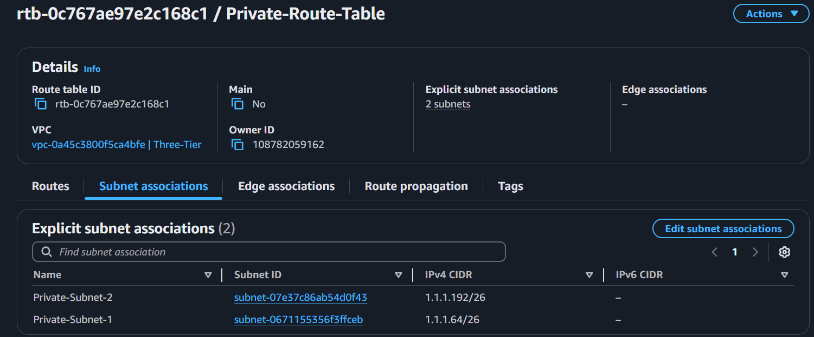

# AWS Three Tier Implementation

### 

1. **VPC and Subnets Creation**
2. **RDS and EC2 instances for Server Creation**
3. **Website Execution**
4. **Application Load Balancer Implementation**
5. **Web-Server Relocation**


## Creating VPC & Subnets

### **Description:**

Creating VPC with two availability zones and each availability zone with two subnets (Private and public).


#### **I - Create VPC :**


1. **Create VPC**
2. **VPC settings**: VPC only
3. **Name**: Three-Tier
4. **IPv4 CIDR**: 10.0.0.0/24 (256 IP's).
Each subtnet with 64 IP's

#### **II - Create Public and Private Subnet with two availability zones :**


 1. **Create Subnet**
 2. **VPC**: Select the created VPC
 3. **Subnet Setting**
 4. **Subnet Name**
 5. **Availability Zone**
 6. **IPv4 subnet CIDR block**

 > **CIDR Block** : We have 4 subnets and total of 256 IP's allocated for this VPC in CIDR block. Allocate each subnet with 64 IP's
 >
 >CIDR blocks will be :
 >
 > 1.1.1.0/26 , 1.1.1.64/26 , 1.1.1.128/26 and 1.1.1.192/26
 > 
 > **For each availability zone create 1 private and 1 public subnet** - A subnet becomes only public or private by attaching it with the Internet gateway or NAT gateway (which allows only outbound from the subnet)

 


#### **III - Create Nat Gateway and Internet Gateway to make the subnets public and private :**
#### **Creating IGW:**
 1. **Create Internet Gateway**
 2. **Name**
 3. **Create**
 4. **Go to the created Internet Gateway and attached it to our VPC**

 

#### **Creating NAT Gateway**:
 1. **Create NAT gateway**
 2. **Name**
 3. **Select the subnet**: Select Public-Subnet-1.
 4. **Connectivity Type** : Public
 5. **Allocate Elastic IP**
 6. **Create**

 

 #### **IV - Create Route Tables for Private and Public subnets.**
 
 In route table we make the subnet association and we will link IGW to public route table and NAT to private route table which makes the subnets as public and private  

 1. **Create route tables**
 2. **Name** : Public-Route-Table / Private-Route-Table
 3. **VPC**: Three-Tier-VPC
 4. **Create** : Public

 Now go to Public Route table : 
 
 1 . Associate the public subnets created


  

2 . Add route to the created IGW  

  

Now, Same way create Private-Route-Table.

Go Private Route Table:

 1 . Associate the private subnets created


  

2 . Add route to the created NAT gateway  

  

> Now, the subnets became truly Public and Private


 #### **V - Checking the Flow of created VPC**

 Got to the Three-Tier VPC and Resource MAP

 


## Creating Servers for Three-tier Architecture:

#### **I - Create Database server (RDS) :**


Before setting up the database (DB) server, we need to create a DB Subnet Group. A DB Subnet Group ensures high availability by allowing RDS to operate in multiple Availability Zones (AZs). This setup improves disaster recovery and failover handling.

Since the database should be placed in a private subnet (for security reasons), we must select two private subnets from different AZs. This ensures that if one AZ fails, the database remains accessible from the other AZ.

#### **Create DB subnet group**

 1. **Go to RDS -> Subnet groups -> Create DB subnet Group**
 2. **Name**
 3. **Select VPC**: Three-Tier VPC
 4. **Add Subnets**
 5. **Select the availability zones**: select the 2 AZs we used. 
 6. **Subnets** : Select the 2 private subnets created
 7. **Create**


#### **Create DB server**

 1. **Go to RDS -> Databases -> Create Database**
 2. **Standard Create**
 3. **Engine Options**: MySQL
 4. **Templates**: Free tier
 5. **Availability and Durability**: Single DB instance
 4. **Settings**
    * DB instance Identifier : DB-Server
    * Self Managed : Set Master Username and Master Password
 6. **Connectivity**
    * Dont connect to EC2
    * Network type IPv4
    * Select VPC : Three-Tier VPC
    * DB Subnet Group: select db-subnet-group we created
    * Public access: No
    * VPC security group: New
    * New VPC security group name: DB-security-group
    * Select the availability zone where our private subtnet-1 is there for SG
 7. **Database authentication** : Password Authentication
 8. **Create**

>Note: We just created Security group with default rules which should be changed after creating application server.


 >Even though the DB Subnet Group consists of two Availability Zones (AZs), each with one subnet, the database will be launched in only one AZ. This is because the "Availability and Durability" option is set to "Single DB Instance" during RDS creation.
>
>AWS automatically selects the AZ based on network reliability, availability, and durability.
>
>Since we created the Security Group in eu-north-1a, considering factors like latency and network reliability, AWS is likely to launch the DB instance in the private subnet-1 within eu-north-1a.
>
>This can be verified by checking the private IP of the DB server using:
>
> 1. AWS Console → RDS → Databases → Select your DB → Connectivity & Security section
>
>2. Running dig on the RDS endpoint from an EC2 instance in the same VPC.


>The Private IP of DB-server : **1.1.1.117**

DB-server IP comes under the IP range of Private-Subnet-1 which is from **1.1.1.64 to 1.1.1.127 [CIDR - 1.1.1.64/26]**


#### **II - Create Application server (EC2 - Ubuntu) :**

Now we will deploy the Application Server in private-subnet-1, which means it cannot be accessed directly from the internet.

To enable access, we will create a Bastion Host, which acts as an intermediary to securely connect to the application server.
* The Bastion Host will be placed in public-subnet-1 to allow external access.

* The Security Group for the application server should be configured to allow connections from the Bastion Host for secure access.


#### **Create Bastion Host (EC2 - Ubuntu)**

 1. **Go to EC2 -> Instances -> Launch an Instance**
 2. **Name**: Bastion-Host
 3. **AMI**: Free tier
 4. **Instance Type**: Free tier
 5. **Key pair(login)**
    * Create new key pair
    * Key pair name : Bastion-Host
    * Key pair type : RSA
    * File formate : .pem
    * create (file will be downloaded into your local machine)
 6. **Network settings**
    * VPC : Three-Tier
    * Subnet : Public-Subnet-1
    * Auto-assign public IP : Enable (it needs public IP to access through internet )
    * security groups
       * Name: Bastion-Host-SG
       * Inbound Security rules to ***type: SSH & Source type : Anywhere***
 7. **Launch Instance**
>We only allow SSH connection in the inbound, to only allow the systems which has the .pem key of the bastion host 
>
> Private IP of Bastion-Host : 1.1.1.28


#### **Create Application Server (EC2 - Ubuntu)**

 1. **Go to EC2 -> Instances -> Launch an Instance**
 2. **Name**: Application-Server
 3. **AMI**: Free tier
 4. **Instance Type**: Free tier
 5. **Key pair(login)**
    * Create new key pair
    * Key pair name : Application-Server
    * Key pair type : RSA
    * File formate : .pem
    * create (file will be downloaded into your local machine)
 6. **Network settings**
    * VPC : Three-Tier
    * Subnet : Private-Subnet-1
    * Auto-assign public IP : Enable (it needs public IP to access through internet )
    * security groups
       * Name: Application-Server-SG
       * Inbound Security rules to ***type: SSH , Source type : Custom & Source : 1.1.1.28/32 (IP of bastion host)***
 7. **Launch Instance**

 >We only allow bastion host to make SSH connection to the application host by updating the inbound rule of application server.


Next connect to Bastion-Host throught you local machine CMD/terminal.

>Command :  **SSH -i Bastion-Host.pem ubuntu@51.20.89.80**
>
>51.20.89.80 - Bastion-Host Public IP. We need to put public IP because you are connecting it through internet.


Next you need to connect to Application-Server, for that we need to copy the .pem of Application-Server into the bastion host and change permission of that .pem file.

>Command : 
>
>1. **scp -i Bastian-Host.pem Application-Server.pem ubuntu@51.20.89.80:~/Application-Server.pem**
>2. **chmod 400 Application-Server.pem**


Next, login to the Bastion-Host and then make a SSH connection with the Application-Server.


Application Server set up is done, and it is securely accessible via Bastion Host.


Now, we need to give permission to the Applications-Server to access the DB-Server. So, we need to change the inbound rules of DB-Security-Group.

Edit the inbound rule to give only access to Application-Server by adding its IP and remove 0.0.0.0/0 rule


Install MySQL client in the Application Server by :

> sudo apt install mysql-client 

Establish the connection between the Application-Server and DB-server and create Database with a table.


```sh
#this code is used to connect to MySQL-Client
mysql -h <endpoint> -P <port> -u <username> -p

Example:

mysql -h db-practice.xxxxxxxxxxx.amazonaws.com -P 3306 -u admin -p
```


Next we need to deploy the application.

We will be launching a Python-based application using the Flask framework to handle API requests. This Flask application will:

* Accept user inputs from the Web Tier
* Process the data and interact with the Database (RDS)
* Return the required responses to the Web Tier

**Python and Flask framework setup**

Follow these commands and install the packages
>Commands: 
>1. **sudo add-apt-repository universe**
>2. **sudo apt update**
>3. **sudo apt install python3-pip -y**
>4. **pip3 install --break-system-packages flask flask-mysql-connector flask_cors**

Next, we need to create our python file to build the application.

 

This command creates the python file and open it in the editor. Paste this python code, where this python code holds simple application where it gets data (web server will get the data) from the client and save it in the DB and fetch all the details and send to the client (webserver will present it to the user)

 

After pasting this code in that file , give Ctrl+o and Enter to save and give Ctrl+x to exit. Now launch the python file using the following command ***nohup python3 app.py***

 


> Now python app will running under the address ***http://1.1.1.85:5000***
>
> ***1.1.1.85*** is the private ip of the application server and ***5000 is the port number*** the application is launched

Check whether application is working properly by doing a HTTP request to it. 

Open new cmd prompt and login to the Application-Server through Bastion-Host and then make the request to add_user.

> Command :
> * **curl -X POST http://1.1.1.85:5000/api/add_user -H "Content-Type: application/json" -d '{"name": "AWS", "age": "12",
"email": "Some@email"}'**
>
>.

 

Make a request to fetch all users through get_users

> Command :
> * **curl http://1.1.1.85:5000/api/get_users**
>
>.

 

The Application Server is now up and running, and successfully communicates with the Database Server (RDS).
Using the Python Flask application, we can now:
* Post data to the database
* Retrieve data from the database

>**Backend is fully functional Now**

#### **III - Create Web server (EC2 - Ubuntu) :**
 


The presentation tier is the top level of the three-tier architecture and is accessible by users.

#### **Create Application Server (EC2 - Ubuntu)**

 1. **Go to EC2 -> Instances -> Launch an Instance**
 2. **Name**: Web-Server
 3. **AMI**: Free tier
 4. **Instance Type**: Free tier
 5. **Key pair(login)**
    * Create new key pair
    * Key pair name : Web-Server
    * Key pair type : RSA
    * File formate : .pem
    * create (file will be downloaded into your local machine)
 6. **Network settings**
    * VPC : Three-Tier
    * Subnet : Public-Subnet-1
    * Auto-assign public IP : Enable (it needs public IP to access through internet )
    * security groups
       * Name: Web-Server-SG
       * Inbound Security rule 1 : ***type: HTTP , Source type : ALL IPv4  & Source : 0.0.0.0/0 (Entire Internet)***
       * Inbound Security rule 2 : ***type: SSH , Source type : ALL IPv4  & Source : 0.0.0.0/0 (Entire Internet)***
 7. **Launch Instance**


 Next, Go to Application-Server-Secrity-Group and add a inbound rule to allow Web-Server to make request to application server.(add the private IPv4 of web server)

 

We configure Custom TCP to allow access only through port 5000, enabling the web server to communicate securely with the application server. This ensures that the web server has access solely to the Python application running on the application server.

Launch the the web server and make a request to the python app running in the application server.

 

 Successfully Web server is able to make a request to the application running in the application server.

 Now, We will create HTML file (which will be presented to the user) and host it through the apache2 engine. Install the requried packages.

 >Commands:
 >* **sudo apt update && sudo apt install apache2 -y**
 >* **sudo a2enmod proxy proxy_http**
 >
 > .

#### **Apache Proxy**
The website will be launched using Apache2, and it will be accessible on the internet through a public IP (our EC2 public IP). However, the website cannot directly communicate with the application server using this public IP, even though the web server is inside the VPC. 

Systems inside the VPC can only communicate with each other through private IPs. 

Once website is hosted it will be on public IP where application-server is hidden to it because application server is in private subnet. To resolve this issue, we will configure Apache2 to act as proxy. 

* Apache2 will manage all communication between the website and the application server. 
* When users access the website, their requests will first reach Apache2, which will act as an intermediary.
* Apache2 will then forward these requests internally to the application server, ensuring smooth communication between the website and the application and allowing all interactions to happen securely within the VPC.

> ***Note: Apache2 runs internally on the web server and can communicate with the application server. However, the website hosted on Apache2 is external, so it cannot directly access the application server.***

#### **Proxy Setup:**

Go to root directory

 

Go to default configuration file of Apache2 (It defines how Apache handles incoming web requests.)

> Commands:
>
> * ***cd /etc/apache2/sites-available***
> * ***sudo nano 000-default.conf*** 
>
>.

 

 Now add these two commands inside the file to enable the proxy

 > Commands:
>
> * ***ProxyPass "/api/" "http://1.1.1.85:5000/api/"***
> * ***ProxyPassReverse "/api/" "http://1.1.1.85:5000/api/"*** 
>
> where http://1.1.1.85:5000/api/ is our python application URL , where previously we used this URL to make request to the application through ***curl***

After pasting this code in that file , give Ctrl+o and Enter to save and give Ctrl+x to exit.

 

Next we need to write our website file inside the default location where Apache serves web pages,

Go to root directory and go to default location and open the index.html (remove all the codes inside it and give your code).

 
Paste the code inside this html file and save it.

 

Next launch the apache server by,

> Command:
> * sudo systemctl start apache2
>
>.

## Website Execution

Now, paste the Public IPv4 of  web server in a browser. Website will be live now and use the website to check whether all the functionalities are working(adding user and fetching all users data).

#### Initial Page

 

#### Fetching Users List 

 

#### Adding User Data

 

#### Checking whether the data is added by Refresh List

 

> .
>
> Three Tier Architecure Execution Completed !!!
>
> .

## Application Load Balancer

 


As for now, we have only one webserver but when it comes to commercial level,traffic will be more so we would need many webservers --> appplication servers --> RDS to maintain the traffic and give a smooth experiance to the customer. 

To regulate the traffic between various webservers we need implement to Application Load Balancer.


#### **Create Application Load Balancer**

 1. **Go to EC2 -> Load balancers -> Create**
 2. **Compare and select load balancer type**: Application Load Balancer - Create
 3. **Load Balancer Name**: Three-Tier-ALB
 4. **Scheme**: Internet-Facing
 5. **Load balancer IP address type** : IPv4
 6. **Network Mapping**
    * VPC : Three-Tier
    * Mappings-Availability Zones : 
      * eu-north-1a (Public Subnet)
      * eu-north-1b (Public Subnet)
 7. **Security Groups** -> create a new security group: 
   * Name: Application-Load-Balancer-Security-Group
   * Outbound Security rules to ***type: HTTP , Source type : ALL IPv4  & Source : 0.0.0.0/0 (Entire Internet)***
   * Inbound Security rules to ***type: HTTP , Source type : ALL IPv4  & Source : 0.0.0.0/0 (Entire Internet)***
 8. **Listeners and routing**:
   * Protocol - HTTP : PORT - 80
   * **Select a target group (create a target group and then select)**: Create Target Group
      * Target Type : Instances
      * Target Group Name: Three-Tier-Target-Group
      * Protocol : Port - it should same as ALB's (HTTP & 80)
      * IP address type IPv4
      * VPC : Three-Tier
      * Next - Register targets
      * Select the webservers (for our case only 1 webserver available)
      * Include as pending below
      * Create target group
      * Go to the ALB creation TAB
 9. Create load balancer

 

 After creation, DNS will be generated. Where our website will be visible in that domain name.

 >Generated Domain Name : **Three-Tier-ALB-691405850.eu-north-1.elb.amazonaws.com**


Since, ALB came into the picture there is no purpose of Web-Server serving in public subnet. So, we need to relocate the Webserver to private subnet before that we need to change the inbound rules of Web-Server where only ALB should give request to Web-Server.


## Relocating Web-Server to Private-Subnet


It is not possible to directly place the Web-Server instance into the Private-Subnet because there will be a primary Network-Interface of Public-Subnet will be attached to it while creating it in the Public-Subnet which is permanent to that EC2. 

To relocate the Web-Server, extract the AMI(Amazon Machine Image) of the Web-Server and then using that AMI create a Web-Server in the Private-Subnet.


After creating the AMI, delete the existing Web-Server

#### **Create Web-Server In Private-Subnet**

 1. **Go to EC2 -> Instances -> Launch an Instance**
 2. **Name**: Web-Server
 3. **My AMIs**: Owned by me
 4. **Amazon Machine Image (AMI)**: Select the extracted Web server's AMI 
 5. **Key pair(login)**: Select the key pair Web-Server (Which is already created while creating Web-Server in Public-Subnet)
 6. **Network settings**
    * VPC : Three-Tier
    * Subnet : Private-Subnet-1
    * Auto-assign public IP : Disable
    * security groups
       * Name: Web-Server-SG
 7. **Launch Instance**


> Private IP of new Web-Server : 1.1.1.75

Now, Web-Server is placed in Private-subnet and we need to access it through Bastion-Host only because it is in Private-Subnet.

Copy the Web-Server.pem into the Bastion-Host 


Login to the Bastion-Host and then login to Web-Server


Now launch the apache server by:
> sudo systemctl start apache2

To make the Web-Server to access the application server, we need to add the inbound rule for allowing the Web-Server to access it. (Delete IP of old Web-server and add the IP of new Web-Server)


Before Launching the Website, Register the newly created Web-Server in the Target Groups.


1. **EC2 -> Target groups -> Three-Tier-Target-Groups**
2. **Register Targets**
   * Select the Web-Server 
   * Include as pending below
   * Register pending targets


Now, Copy the DNS of ALB and check Website.

#### Initial Page

 

#### Fetching Users List 

 

#### Adding User Data

 

#### Checking whether the data is added by Refresh List

 

<h1 style="text-align: center;">நன்றி வணக்கம் 🙏</h1>
